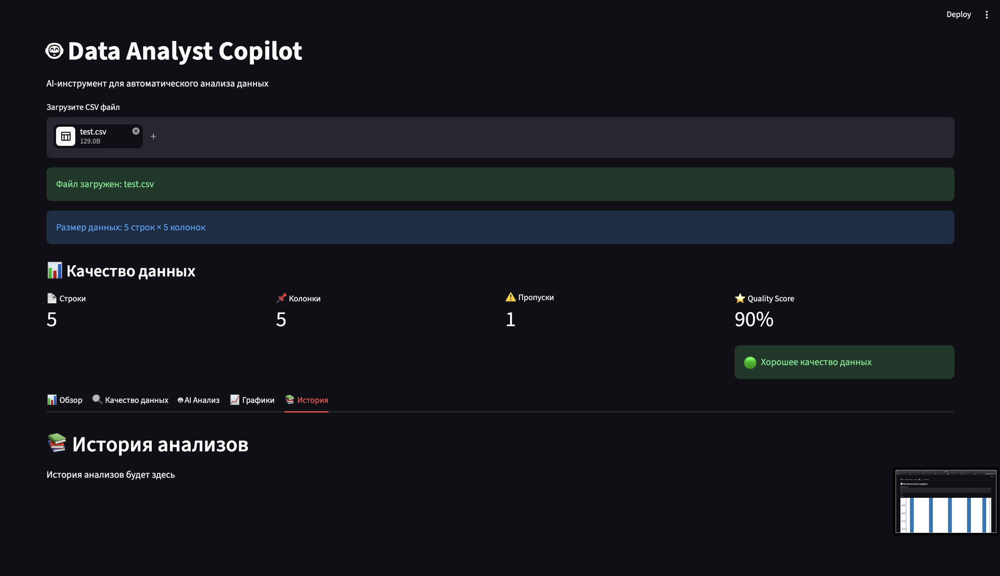
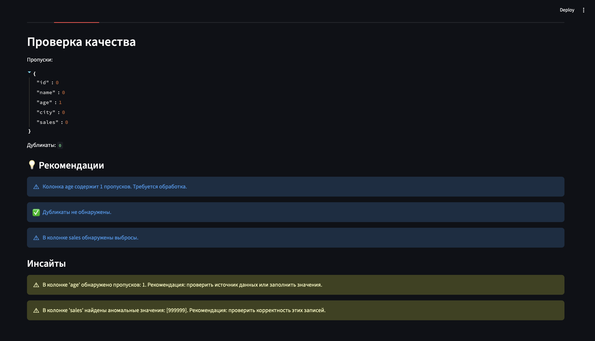
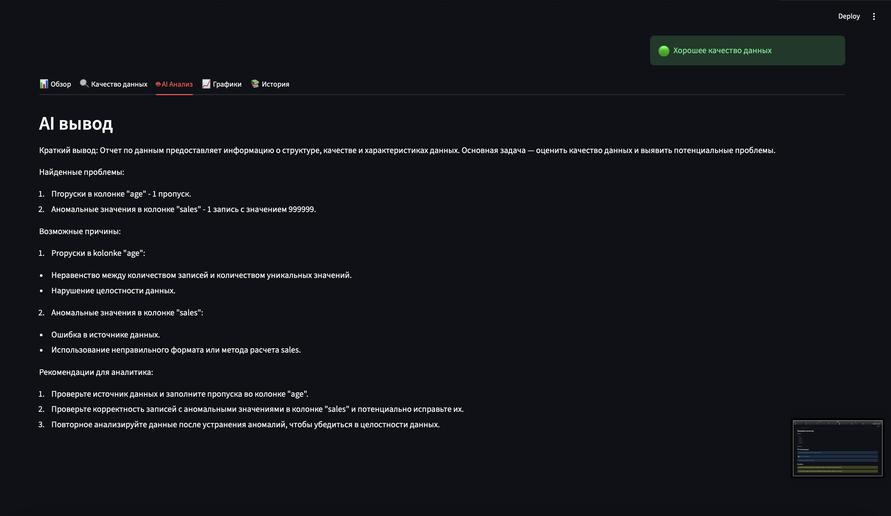
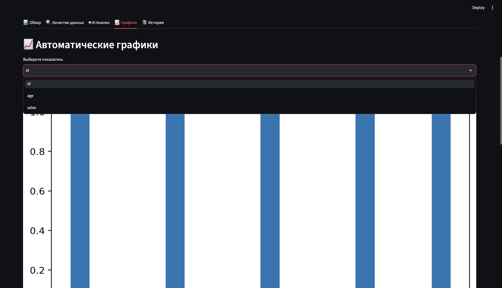

# 🤖 Data Analyst Copilot

Автоматизированный инструмент для анализа CSV-файлов и оценки качества данных.

Проект помогает Data Analyst быстро проводить первичный анализ данных (EDA), выявлять проблемы качества данных, строить визуализации и автоматически получать рекомендации с помощью локальной LLM (Ollama).

---

## 🚀 Возможности

### 📊 Анализ качества данных

- количество строк и колонок
- пропущенные значения
- полные дубликаты
- дубликаты без учета ID
- Data Quality Score

---

### 🔍 Exploratory Data Analysis (EDA)

- статистический анализ
- профиль колонок
- поиск выбросов (IQR)
- корреляционный анализ
- гистограммы распределений
- анализ числовых признаков

---

### 🤖 AI-анализ

Проект использует локальную LLM (Ollama) для:

- автоматического анализа качества данных
- генерации выводов
- формирования рекомендаций

---

### 💡 Автоматические рекомендации

Система автоматически сообщает о:

- пропущенных значениях
- дубликатах
- выбросах
- проблемах качества данных

---

### 📄 Отчеты

- HTML-отчет
- история анализов
- просмотр результатов через Streamlit

---

## 🛠 Используемые технологии

- Python
- Pandas
- Streamlit
- Matplotlib
- Seaborn
- Requests
- Ollama (Llama)

---

## 📂 Структура проекта

```text
data-analyst-copilot/

├── app/
│   ├── dashboard.py
│   ├── analyzer.py
│   ├── ai_analyzer.py
│   ├── data_loader.py
│   ├── html_report.py
│   ├── insights.py
│   ├── profile_columns.py
│   ├── quality_score.py
│   ├── recommendations.py
│   ├── report_history.py
│   └── visualizer.py
│
├── reports/
│   ├── history/
│   └── analysis_report.html
│
├── requirements.txt
├── README.md
└── .gitignore
```

---

## ▶ Запуск

```bash
pip install -r requirements.txt

streamlit run app/dashboard.py
```

---

## 📸 Интерфейс

### Главная страница



### Проверка качества данных



### AI-анализ



### Автоматические графики


---

## 🎯 Цель проекта

Проект создан как pet-проект для демонстрации навыков Data Analyst:

- Data Quality
- Exploratory Data Analysis
- автоматизация анализа данных
- визуализация
- применение LLM в аналитике
- разработка внутренних аналитических инструментов
